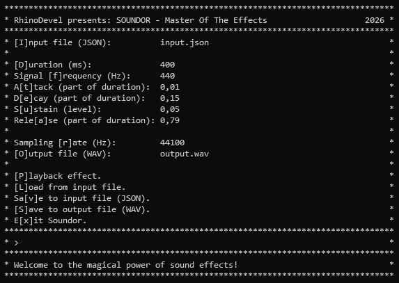

# Soundor
A console-based sound effect generator.

Written in C#, should be working with Linux and Windows.

In addition to the "UI" mode, it also has a batch mode that puts together a WAV
file from multiple JSON input files of effects generated with Soundor.
Take a look at the [Examples](./Examples) folder, the format of e.g.
[vi.json](./Examples/vi/vi.json) is pretty self-explanatory.
